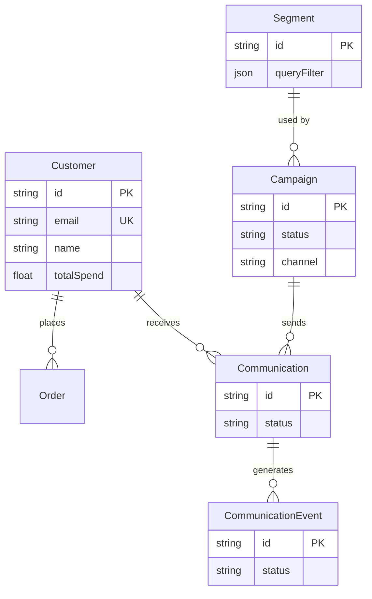
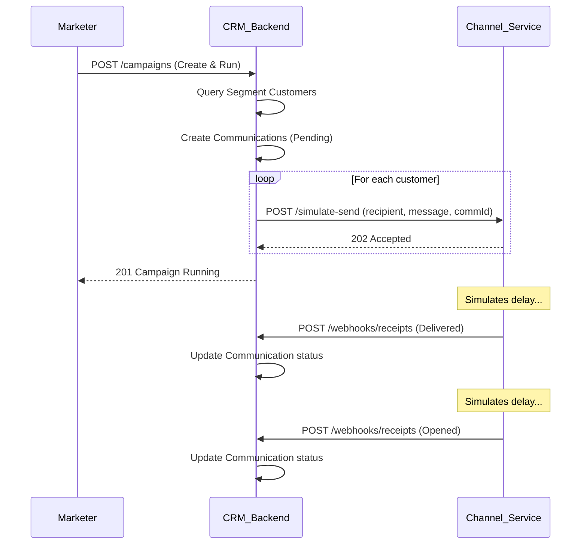

# Architecture

```mermaid
graph TD
    User([Marketer]) --> Frontend[Next.js Frontend (Vercel)]
    Frontend --> Backend[Express API (Render/Railway)]
    Frontend --> AI[OpenAI API]
    
    Backend --> DB[(PostgreSQL)]
    Backend --> OpenAI[OpenAI API]
    
    Backend -- "Dispatch Messages" --> ChannelService[Channel Service (Microservice)]
    ChannelService -- "Async Webhooks" --> Backend
```

## ER Diagram



## Sequence Diagram: Campaign Lifecycle


